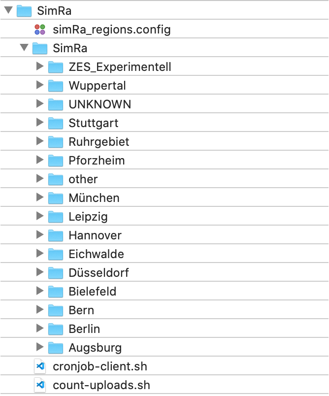

## Cronjob for updating statsboard 

### (1) Putting the files in place

Firstly, place the two files into the directory structure as shown in the picture below in order for paths in scripts to be correct. That is, they are inside the first SimRa folder but OUTSIDE the second SimRa folder.



### (2) Set up SSH key & add to agent

In terminal, type this command (replacing the e-mail address with the one your GitHub account is linked with):

```
ssh-keygen -t rsa -b 4096 -C "your_email@example.com"
```

This generates a new SSH key. When prompted to "Enter a file in which to save the key", press enter to accept the default location. You will then be prompted to enter a secure passphrase; just hit enter again for no passphrase.

Add the key to the SSH agent with the following two commands: 

```
eval "$(ssh-agent -s)"
ssh-add ~/.ssh/id_rsa
```

### (3) Add public SSH key to GitHub repo

Then, print the public key using this command:

```
cat ~/.ssh/id_rsa.pub
```

Copy the public key to clipboard. Go to the GitHub repository. From the bar on the left, choose 'Deploy Keys'. Click 'add deploy key'. Paste the public key.

### (4) Configure Git on VM

Associate your account with the Git installation on VM:

```
git config --global user.name "Your Name"
git config --global user.email "youremail@yourdomain.com"
```

### (5) Configure Git on VM

Now run the `cronjob-client.sh` script manually once to see if everything is working correctly:

```
bash cronjob-client.sh
```

Importantly, use `bash` instead of `sh` to run it as some of the syntax is bash-specific.

Accept GitHub as a known host (yes).

### (6) Set up the CronJob

Open the CronTab with a text editor (Vim, of course 🤠):

```
crontab -e
```

At the bottom of the file, add this (replacing YOUR-USERNAME with your username, of course):

```
20 10 * * * bash /home/YOUR-USERNAME/SimRa/cronjob-client.sh  >> /home/YOUR-USERNAME/cronbuglog.txt 2>&1
```

This means: every day at 20 past 10 (check the VM's time zone to determine a reasonable time for daily job execution) run the script `cronjob-client.sh` and print the output of any error messages to a `cronbuglog.txt` file in the specified location.